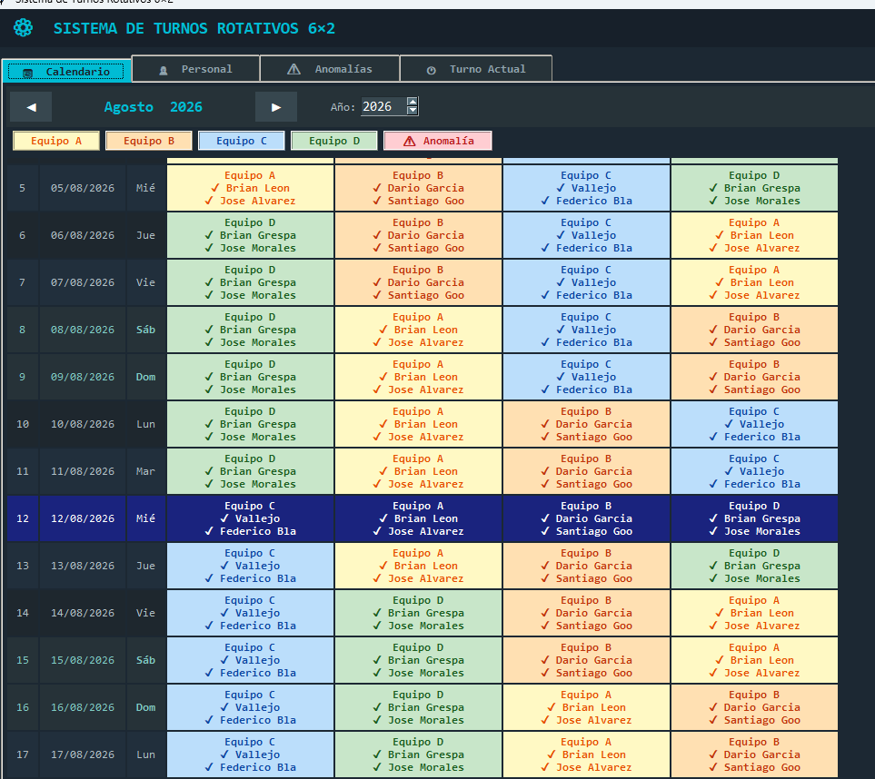
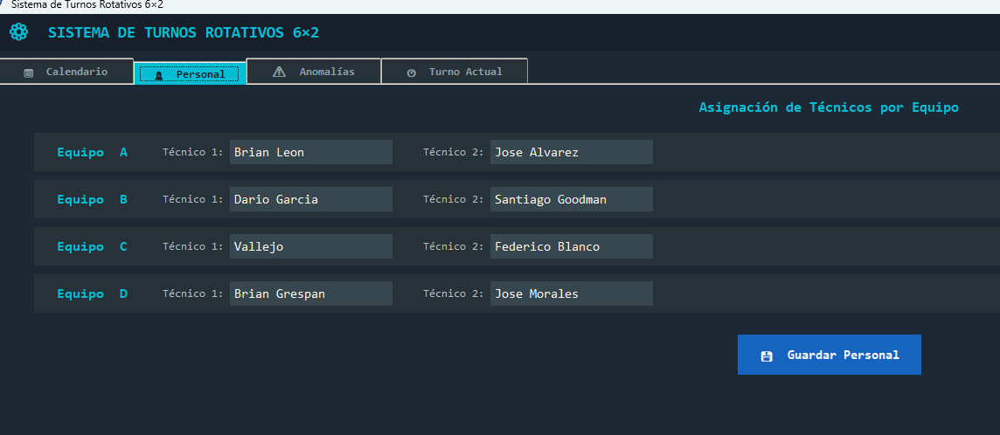
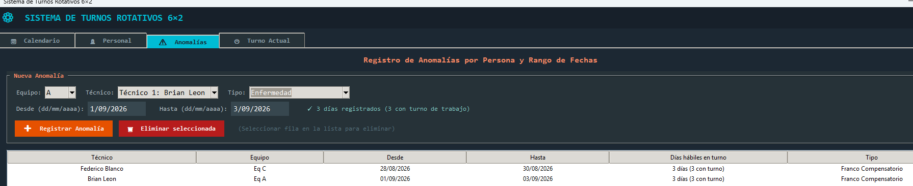
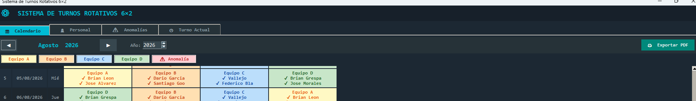

# 📅 Shift Scheduler - GUI

[]()
[]()

> A powerful desktop GUI application to automate shift scheduling for work teams.

---

## 📸 Screenshots / Demo

Here’s a quick preview of the application interface and its functionality:

| Main View  | Calendar Preview  | Anomalies / Exceptions  | PDF Export  |
| :---: | :---: | :---: | :---: |
|  |  |  |  |

---
## 🚀 About The Project

This is a **GUI-based shift scheduler** that generates clear and organized calendars. 

It is specifically designed for teams structured into **4 groups of 2 people**, following a **6 days ON, 2 days OFF** rotation cycle (Morning, Afternoon, and Night shifts). 

### Key Features
- 🖥️ **User-Friendly GUI**: Intuitive graphical interface for easy management.
- 🖨️ **Print-ready PDFs**: Generate PDF calendars that are perfect for printing and physical distribution.
- 👁️ **On-Screen Preview**: View the full schedule directly on your screen before exporting.
- ⚙️ **Customizable Rotations**: Handles morning, afternoon, and night shifts seamlessly across 4 groups.

---

## 🌍 Languages

- **English**: GUI-based shift scheduler that generates calendars (printable in PDF or viewable on screen) for 6 workdays (morning, afternoon, and night shifts) and 2 days off, for 4 groups of 2 people.
- **🇨🇳 简体中文**: 带图形界面（GUI）的轮班排班系统，可生成班表（支持导出 PDF 打印或屏幕预览）。采用 6 天工作（早班、中班/下午班、夜班）与 2 天休息的模式，适用于 4 个小组（每组 2 人）。
- **🇪🇸 Español**: Sistema de turnos con GUI gráfica que permite armar el calendario (imprimible en PDF o visualización en pantalla) de 6 días de trabajo en mañana, tarde y noche, y 2 días de descanso. Diseñado para 4 grupos de 2 personas.

---

## 🛠️ Getting Started

Ejecutar la aplicación es muy sencillo. Hemos incluido scripts automatizados que verifican tu instalación de Python, instalan las dependencias necesarias (como `reportlab`) y lanzan el programa por ti.

### ✅ Requisito previo (Prerequisite)
- **Python 3.x**: Asegúrate de tener Python instalado en tu sistema. Si no lo tienes, descárgalo desde [python.org](https://www.python.org/). *(Los scripts te avisarán si falta Python).*

### ▶️ Ejecutar la aplicación

Elige el script según tu sistema operativo:

- **🪟 Windows**: Haz doble clic en el archivo **`run.bat`** que está en la carpeta del proyecto.
  
- **🐧 Linux / macOS**:
  1. Abre una terminal en la carpeta del proyecto.
  2. Dale permisos de ejecución al script (solo la primera vez):
     ```bash
     chmod +x run.sh